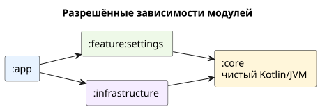
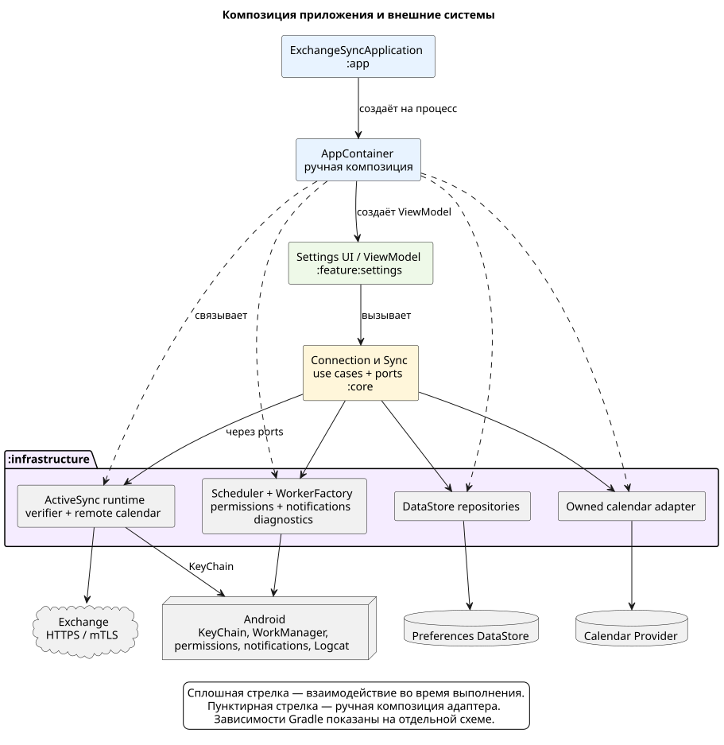

# Архитектура приложения

[Все документы](README.md)

Exchange Sync самостоятельно переносит основной календарь частного Exchange
в отдельный календарь Android. Здесь описаны граница продукта, модули и
владельцы данных; детали процессов вынесены в тематические документы.

## Текущая граница

| Область | Реализовано |
|---|---|
| Платформа | Android 16; прямая локальная установка APK |
| Подключение | Один профиль, ActiveSync через HTTPS:443 и mTLS |
| Направление | Только Exchange → Android; локальные изменения и ответы на приглашения не отправляются |
| Календарь | Один основной календарь; вся возвращённая сервером история и будущие события |
| События | Напоминания, участники, приглашения, повторения и исключения — по [правилам представления](event-mapping.md) |
| Выполнение | Ручной запуск и периодическая работа через WorkManager, независимо от Activity |
| Проблемы | Сохранённое состояние ошибки и одно системное уведомление при наличии разрешения |

Приложение не регистрирует Android Exchange account или SyncAdapter.
Нормативные требования: [подключение](../openspec/specs/connection-settings/spec.md),
[календарь](../openspec/specs/calendar-sync/spec.md),
[фоновая работа](../openspec/specs/sync-scheduling/spec.md),
[уведомления](../openspec/specs/sync-problem-notifications/spec.md) и
[граница проекта](../openspec/specs/project-bootstrap/spec.md).

## Модули и зависимости

| Модуль | Ответственность |
|---|---|
| `:app` | Application/Activity, manifest, permission и certificate launchers, ресурсы уведомления и ручная композиция |
| `:core` | Android-независимые модели профиля/календаря, sync state machine, fencing, mapping и use cases |
| `:feature:settings` | Immutable UI state, ViewModel, Compose-форма, статус синхронизации и управляющие действия |
| `:infrastructure` | DataStore, KeyChain/TLS, ActiveSync/WBXML, Calendar Provider, WorkManager, permissions и notifications |

`:feature:settings` не зависит от `:infrastructure`, а `:core` остаётся чистым
Kotlin/JVM-модулем без Android и HTTP API. Такое разделение оставляет доменную
политику и переходы состояния доступными для локальных JVM unit-тестов.

## Композиция приложения

`ExchangeSyncApplication` создаёт один `AppContainer` на процесс.
Контейнер вручную связывает следующие компоненты:

| Группа | Компоненты |
|---|---|
| Подключение | Общий `VerifyConnection` для Save и повторной проверки; `SaveConnection` |
| Синхронизация | Lifecycle, manual/periodic triggers, ограниченный по объёму execution slice |
| Данные | Общий Preferences DataStore для профиля и sync metadata; адаптер собственного календаря |
| Сеть | Один ActiveSync runtime с сеансами, привязанными к точному профилю |
| Android | WorkManager scheduler, ручной `WorkerFactory`, permission port, generation-aware notification reporter |
| Диагностика | Logcat adapter и Android-независимый `SyncDiagnosticsPort` |
| UI | `SettingsViewModel` через lifecycle-aware `ViewModelProvider` |

Dependency-injection framework не используется. Android KeyChain chooser
остаётся на уровне Activity, поэтому feature-модуль получает только callback и
alias выбранного сертификата.

## Основные процессы и границы

| Процесс | Где описан |
|---|---|
| Валидация → проверка → commit профиля → запуск синхронизации | [Подключение](connection.md#сохранение-и-повторная-проверка) |
| KeyChain, TLS, capability discovery и HTTP-сеанс | [Транспорт](transport.md) |
| Получение страницы → применение → commit checkpoint | [Синхронизация](calendar-sync.md) |
| Сериализация записей и проверка актуальности worker | [Calendar Provider](calendar-provider.md#конкурентный-доступ) |
| Запуск, продолжение, отмена и отключение | [Фоновая синхронизация](background-sync.md) |

Android API сосредоточены в `:app` и `:infrastructure`.
ViewModel защищает редактируемую форму от поздней загрузки и результатов
проверки, а core координирует фоновые операции через порты.

## Хранение данных

| Данные | Где находятся | Срок жизни |
|---|---|---|
| Email, `domain\login`, hostname, непрозрачный KeyChain alias | Preferences DataStore | До замены профиля |
| Generation, run token, phase, safe problem, device ID, last-success, checkpoints и служебные sync-флаги | Namespace `sync.` того же DataStore | Между запусками приложения |
| Перенесённые события и дочерние строки | Собственный календарь в Android Calendar Provider | До серверного изменения, очистки или восстановления зеркала |
| Закрытый ключ | Android KeyChain; приложение получает runtime handle | Управляется Android |
| Cookie, capabilities, подготовленная папка и pacer | Память ActiveSync-сеанса | До завершения процесса или вытеснения сеанса |
| Успешная TLS-сводка | Текущее состояние ViewModel | Пока результат актуален; не восстанавливается из DataStore |
| Диагностические записи | Системный Logcat | До ротации или очистки буфера Android |

Пароль в модели отсутствует. DataStore не хранит ключи и байты сертификатов,
ответы сервера, event payload, TLS-сводки, exception text или stack traces.
Backup приложения отключён. Политика логов описана отдельно в
[справочнике диагностики](reference/diagnostic-fields.md).

## Термины

| Термин | Значение |
|---|---|
| `generation` | Поколение синхронизации; изменение делает прежнюю работу неактуальной |
| `run token` | Идентификатор логического запуска внутри поколения; Cancel увеличивает его |
| `fence` | Пара generation/run token, проверяемая перед побочными эффектами |
| `checkpoint` | Сохранённая позиция протокола после полностью применённой страницы |
| `owned calendar` | Календарь, принадлежащий приложению по внутренним признакам ownership |
| `page` / `sub-batch` | Страница изменений Exchange / один атомарный вызов записи части её плана |
| `slice` / `continuation` | Ограниченный участок выполнения / фоновая задача его продолжения с тем же fence |
| `coalesce` / `follow-up` | Объединение повторных запросов / одна сохранённая потребность в следующей проверке |
| `pending cleanup` | Сохранённая необходимость удалить календарь после неудачной очистки |
| `exponential backoff` | Экспоненциальное увеличение задержки повторов, начиная с 30 секунд |

## Проверка реализации

Автоматическая граница ограничена JVM/Android-local unit-тестами без Robolectric
и instrumentation. Pure policy, persistence codec, WBXML/ActiveSync fixtures,
mapping, provider batch planning, worker policy, TLS, notifications и ViewModel
проверяются с fakes. Android KeyChain, настоящий Calendar Provider, WorkManager
runtime и живой Exchange/mTLS server остаются тонкими интеграционными границами,
код для которых проверяется компиляцией, Android Lint и debug-сборкой. Полный
server-backed checklist для этих границ успешно пройден вручную на Xiaomi 17 с
Android 16 и реальным Exchange Server, включая фактическое 15-минутное
исполнение periodic work через WorkManager.

Актуальные команды находятся в [`AGENTS.md`](../AGENTS.md).
