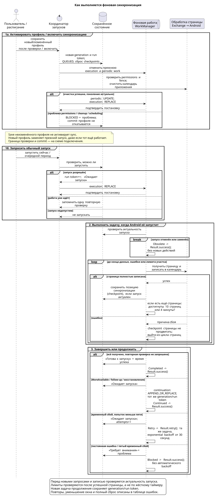
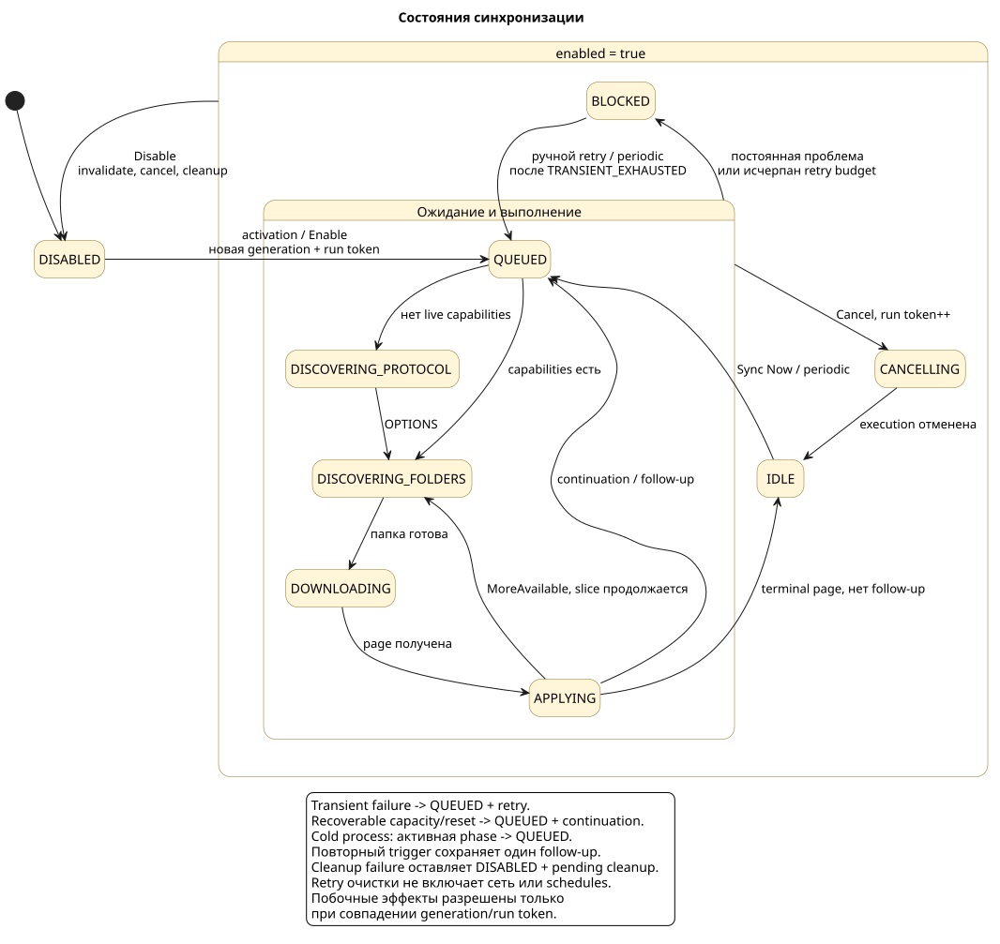
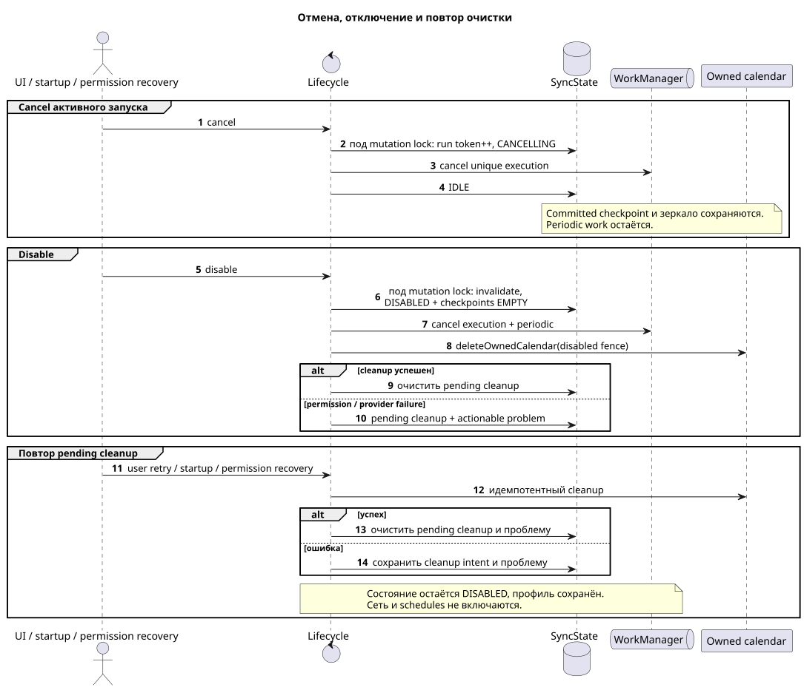

# Фоновая синхронизация и управление

[Все документы](README.md)

Синхронизация продолжает работать, когда экран приложения закрыт или свёрнут.
За запуск задач отвечает Android WorkManager. Приложение хранит прогресс,
поэтому после остановки процесса может продолжить с последней сохранённой
позиции синхронизации.

## Содержание

- [Запуск и продолжение](#запуск-и-продолжение)
- [Состояния и действия](#состояния-и-действия)
- [Ошибки и повторы](#ошибки-и-повторы)
- [Отключение и очистка](#отключение-и-очистка)
- [Разрешения](#разрешения)
- [Уведомление о проблеме](#уведомление-о-проблеме)
- [Связь с реализацией](#связь-с-реализацией)

## Запуск и продолжение

### Когда начинается синхронизация

| Повод | Что происходит |
|---|---|
| Сохранён новый или изменённый профиль | Приложение очищает свой календарь и запрашивает полную синхронизацию |
| Синхронизация снова включена | Начинается полная синхронизация, восстанавливается расписание |
| Нажата «Синхронизировать сейчас» (`Sync Now`) | Запрашивается новая попытка от сохранённой позиции; если полный сброс уже требуется, выполняется он |
| Наступил очередной период | WorkManager может запустить синхронизацию, если есть сеть и состояние допускает запуск |

Периодическая задача одна, с интервалом **15 минут**. Это не обещание точного
времени: Doze, экономия батареи, системные квоты и отсутствие сети могут
отложить выполнение. Ручной запрос также передаётся WorkManager и требует сети.

### Как выполняется один запуск

Сервер отдаёт изменения страницами. Приложение получает страницу, записывает
её в свой календарь Android и только после полного успеха сохраняет позицию
протокола — **checkpoint**. Следующий запрос продолжает с этой позиции.

Работа делится на ограниченные участки. После успешной страницы, если на сервере
остались изменения, проверяются два порога: **10 страниц** или **4 минуты**.
При достижении любого порога следующая фоновая задача продолжает тот же запуск.
Текущая страница не обрывается по таймеру и может обрабатываться дольше четырёх минут.

### Если новый запрос пришёл во время работы

Параллельная синхронизация не создаётся. Приложение запоминает не более одной
потребности проверить изменения ещё раз после текущего запуска. Сама кнопка
`Sync Now` на время ожидания и выполнения недоступна.

Если Android остановил процесс, при восстановлении активное состояние
переводится в «Ожидает запуска» (`QUEUED`), а приложение восстанавливает
необходимую фоновую работу. Продолжение не зависит от прежнего экрана.

## Состояния и действия

На экране видны текущий этап, время последней успешной синхронизации и понятная
категория проблемы. Схема показывает переходы; точные имена состояний из кода
приведены в [справочной таблице](#связь-с-реализацией).

### Что делают кнопки

| Действие | Когда доступно | Результат |
|---|---|---|
| Синхронизировать сейчас — `Sync Now` | Профиль сохранён, синхронизация включена, состояние `IDLE` или `BLOCKED`, активного запуска нет | Новая последовательная попытка; записанные события и checkpoint сохраняются |
| Отменить — `Cancel` | Запуск ожидает выполнения или выполняется | Останавливает текущую попытку; календарь, checkpoint и периодическое расписание остаются |
| Отключить и очистить календарь — `Disable` | Синхронизация включена | Отменяет текущую и периодическую работу, удаляет календарь приложения и checkpoints; профиль остаётся |
| Включить синхронизацию — `Enable` | Профиль сохранён, синхронизация отключена, незавершённая очистка устранена | Запрашивает полную синхронизацию и восстанавливает расписание |
| Повторить очистку календаря | Синхронизация отключена, но календарь ещё не удалось удалить | Повторяет только удаление; сеть и расписание не включаются |

`Sync Now` из состояния с проблемой убирает отображение прежней ошибки на время
новой попытки. События, checkpoint и уже установленная необходимость полного
сброса сохраняются. Если проблема повторится, приложение снова перейдёт в
`BLOCKED`; ручная попытка будет доступна позднее.

Отмена действует на границах операций: уже выполняющийся атомарный вызов записи
не прерывается. Перед следующим запросом или пакетом записи приложение
проверяет, что запуск ещё актуален. Подробнее:
[защита от устаревшей работы](calendar-provider.md#конкурентный-доступ).

## Ошибки и повторы

| Ситуация | Что делает приложение |
|---|---|
| Временный сетевой сбой: timeout, DNS, I/O, HTTP 408/429/5xx или прерывание со стороны Android | Сохраняет checkpoint и повторяет попытку с растущей задержкой, начиная с 30 секунд |
| Пять временных сбоев подряд | Прекращает повторы этого запуска и сохраняет `TRANSIENT_EXHAUSTED`; следующий период может начать новую попытку |
| Проблема сертификата, TLS, доступа, требований provisioning, основного календаря или постоянная ошибка протокола/Calendar Provider | Переходит в `BLOCKED`; каждые 15 минут автоматически не повторяет |
| Сервер отклонил `SyncKey` | Допускает один полный сброс: сначала очистка календаря, затем пустой checkpoint и новые сетевые запросы |
| Страница или пакет записи слишком велики | Если возможно, уменьшает окно запроса и повторяет страницу без продвижения checkpoint; при минимальном окне блокирует запуск |

После успешного завершения запуска счётчик последовательных ошибок и прежняя
проблема очищаются. Не все ограничения допускают уменьшение окна:
[точные лимиты и условия](calendar-sync.md#ограничения-и-уменьшение-окна).
Причины ошибок и результаты восстановления можно проследить по
[диагностике](diagnostics.md).

## Отключение и очистка

Отключение состоит из трёх шагов: сделать прежнюю работу неактуальной →
отменить задачи и расписание → удалить только календарь приложения.
Чужие календари не затрагиваются, профиль подключения сохраняется.

Если нет разрешения на календарь или Calendar Provider отказал в удалении,
приложение сохраняет в DataStore необходимость очистки и категорию проблемы.
Синхронизация уже отключена. На экране доступен повтор очистки, а включение
синхронизации недоступно до её успеха.

Очистка может повториться по кнопке, при запуске приложения или после
восстановления разрешения. Во всех случаях используется один безопасный для
повтора путь. Даже после успешного удаления синхронизация остаётся отключённой;
для её возобновления нужно включение.

## Разрешения

| Разрешение | Если отсутствует |
|---|---|
| `READ_CALENDAR` и `WRITE_CALENDAR` | Синхронизация блокируется до сетевых запросов и записи в календарь; проверенный профиль сохраняется |
| `POST_NOTIFICATIONS` | Синхронизация продолжается, проблема видна на экране, но системное уведомление не показывается |

### Как запрашивается доступ к календарю

При первой активации или повторном включении, когда работа заблокирована
отсутствием доступа, Activity автоматически открывает системный диалог один раз
для текущего поколения синхронизации. Поколение — номер, который меняется при
новой активации; поворот экрана или системное пересоздание Activity не вызывает
повторного диалога для того же номера: он сохраняется в instance state.

| Ответ Android | Следующее ручное действие |
|---|---|
| Повторный запрос ещё допустим; Android показывает обоснование (`rationale`) | Снова открыть диалог разрешения |
| Окончательный отказ (`permanent denial`) | Открыть настройки разрешений приложения и проверить доступ после возвращения |

Доступ проверяется до сети и непосредственно перед операциями Calendar Provider.
После выдачи разрешения незавершённая полная синхронизация может продолжиться
без повторного сохранения профиля.

Если уведомления запрещены, экран объясняет, что фоновые предупреждения
недоступны, и позволяет открыть системные настройки.

## Уведомление о проблеме

При наличии разрешения приложение показывает не более одного постоянного
уведомления: безопасную локализованную категорию проблемы и переход к настройкам.
Уведомление использует стабильный ID; повторные ошибки не создают новые копии.

Перед публикацией или удалением проверяются текущее поколение и сохранённая
проблема. Поэтому запоздавшая задача не изменяет уведомление нового поколения.
Успешная синхронизация очищает проблему и уведомление; смена профиля или
отключение убирает уведомление прежнего поколения.

В уведомление не попадают адрес сервера, логин, содержимое ответов и событий,
материал сертификатов или текст исключений.

## Связь с реализацией

### Имена состояний

Русские подписи на схеме объясняют смысл состояний, а эти идентификаторы
используются в коде и диагностике.

| Подпись на схеме | Состояние |
|---|---|
| Отключена | `DISABLED` |
| Готова к запуску | `IDLE` |
| Ожидает запуска | `QUEUED` |
| Проверяет протокол | `DISCOVERING_PROTOCOL` |
| Готовит папку календаря | `DISCOVERING_FOLDERS` |
| Получает страницу | `DOWNLOADING` |
| Записывает страницу | `APPLYING` |
| Отменяется | `CANCELLING` |
| Требует внимания | `BLOCKED` |

### Технические гарантии

Определения терминов приведены в единой [таблице терминов архитектуры](architecture.md#термины).

WorkManager поддерживает одну `unique periodic work` и одну
`unique execution chain`. Приложение дожидается подтверждения постановки задачи
(`durable enqueue`); после пересоздания процесса сверяет сохранённое состояние
с необходимыми задачами (`reconciliation`).

### Политики WorkManager

Периодический `PeriodicSyncTriggerWorker` только проверяет generation и условия
запуска и запрашивает execution work. Получение и запись страниц выполняются
в `SynchronizationExecutionWorker` через core execution slice.

| Операция scheduler | Политика unique work | Назначение |
|---|---|---|
| Настроить periodic work | `ExistingPeriodicWorkPolicy.UPDATE` | Обновить единственное расписание для generation; интервал 15 минут |
| Начать новый запуск | `ExistingWorkPolicy.REPLACE` | Заменить прежнюю execution chain работой с новым fence |
| Восстановить execution work после перезапуска процесса | `ExistingWorkPolicy.KEEP` | Создать работу, если её нет; сохранить уже поставленную |
| Продолжить текущий запуск | `ExistingWorkPolicy.APPEND_OR_REPLACE` | Добавить continuation в execution chain с теми же generation/run token |

Все эти задачи требуют сети. Новый или изменённый профиль создаёт новое
поколение, отменяет прежние задачи и очищает календарь перед постановкой работы.
Он не объединяется с текущим запуском через `followUpRequested`: объединение
относится к обычным ручным и периодическим запросам.

| Результат core slice | Результат execution worker | Что произойдёт дальше |
|---|---|---|
| `Retry` | `Result.retry()` | WorkManager повторяет ту же задачу с тем же fence и exponential backoff от 30 секунд |
| `Continued` | `Result.success()` | Отдельная continuation уже поставлена через `APPEND_OR_REPLACE` |
| `Completed` | `Result.success()` | Текущая работа завершена |
| `Blocked`, `PermissionRequired` | `Result.success()` | Проблема сохранена в sync state; автоматический backoff не запускается |
| `Obsolete`, `Cancelled` | `Result.success()` | Для этого запуска продолжение не требуется |

`Result.success()` означает завершение задачи WorkManager, а не обязательно
успешную синхронизацию. Её результат определяется сохранённым sync state.
Отмена coroutine со стороны WorkManager пробрасывается как cancellation,
а не преобразуется в результат `Cancelled` из таблицы.

Работа не привязана к Activity, Compose или ViewModel и не использует
foreground service. Из итогового manifest явно удалены добавляемые WorkManager
`SystemForegroundService` и `FOREGROUND_SERVICE`.

Нормативные сценарии:
[sync-scheduling](../openspec/specs/sync-scheduling/spec.md) и
[sync-problem-notifications](../openspec/specs/sync-problem-notifications/spec.md).
