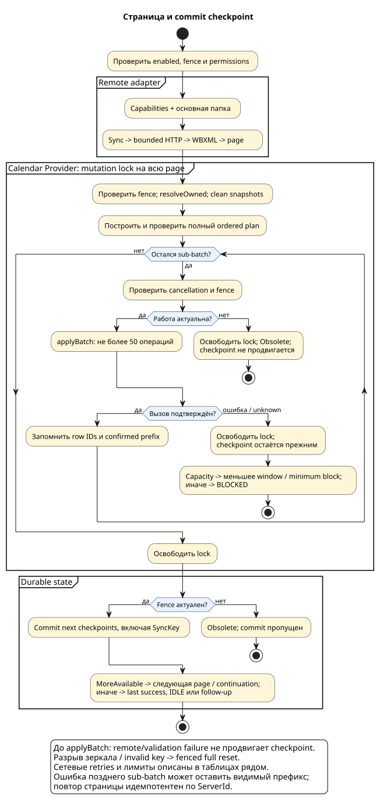

# Собственный календарь и Calendar Provider

[Все документы](README.md)

Адаптер записывает события только в календарь, принадлежащий приложению.
Нормативные сценарии: [calendar-sync](../openspec/specs/calendar-sync/spec.md).
[Правила полей](event-mapping.md) и [получение страниц](calendar-sync.md)
описаны отдельно.

## Содержание

- [Ownership](#ownership)
- [План и пакеты записи](#план-и-пакеты-записи)
- [Конкурентный доступ](#конкурентный-доступ)
- [Восстановление зеркала](#восстановление-зеркала)
- [Диагностика записи](#диагностика-записи)

## Ownership

| Признак | Правило |
|---|---|
| Владелец | Постоянные account name/type и внутреннее имя |
| Отображение | Local, read-only/visible; display name `Exchange-sync` |
| Доступ на запись | Только sync-adapter-qualified URI |
| Display name и email | Не доказывают ownership |
| Чужие календари | Не сканируются для ownership и не входят в plan, sub-batch или cleanup |
| Дочерние операции | Event, attendee, reminder и exception содержат owned calendar/event predicates |

### Миграция имени

При первом запуске обновлённой версии owned calendar переименовывается на месте
по полному ownership tuple. Provider ID, события, reminders и дочерние строки
сохраняются. Успех фиксируется общим DataStore-маркером; при недоступности
Provider маркер не записывается, и миграция повторяется при следующем запуске.

### Удаление

Ровно одна owned calendar row определяется полным внутренним ownership tuple.
Удаление использует collection URI Calendar Provider с sync-adapter query
parameters и повторяет в selection provider `_id`, account name, account type и
internal name; результат проверяется по числу удалённых строк. OEM-календари и,
в частности, строки с `account_name_local` не принимаются за owned calendar, не
ремонтируются и не удаляются.

## План и пакеты записи

Одна remote page преобразуется в канонически упорядоченный provider plan.
Каждый вызов `applyBatch` содержит не более 50 операций и является атомарной
provider transaction. Вся страница не обязана быть атомарной.

| Ссылка / результат | Как обрабатывается |
|---|---|
| Insert внутри текущего sub-batch | Локальная back-reference |
| Event из ранее подтверждённого sub-batch | Возвращённый provider row ID |
| Все sub-batches подтверждены | Разрешён commit следующего SyncKey после проверки fence |
| Поздняя ошибка или неоднозначный вызов | Подтверждённый префикс может быть виден; SyncKey остаётся прежним |
| Повтор страницы | Idempotent upsert по ServerId; явно присутствующие child collections полностью заменяются |

Повтор сходится без дубликатов parent/child rows. Проверка известных
обязательных колонок выполняется для полного плана до первого вызова:
[explicit empty](event-mapping.md#явно-пустые-поля).
При слишком большой transaction действует
[уменьшение окна](calendar-sync.md#ограничения-и-уменьшение-окна).

## Конкурентный доступ

Provider mutations и изменения generation/run token сериализуются общим
`SynchronizationMutationLock` на всю Calendar page. Перед каждым
provider-вызовом проверяются coroutine cancellation и
[fence](architecture.md#термины).

После profile replacement, cancel или disable старый worker не начинает
следующий sub-batch, `resolveOwned` или fenced cleanup. Уже подтверждённая
часть страницы может остаться видимой, но новый SyncKey без полного успеха
не сохраняется.

## Восстановление зеркала

| Ситуация | Действие |
|---|---|
| Дубли собственных calendar rows | `resolveOwned` ремонтирует дубликаты |
| Календарь отсутствует до первой full-sync page | Воссоздаётся и может принять данные |
| Календарь исчез после committed full-sync page или в incremental run | Fenced full reset вместо применения следующей страницы |
| Owned event удалён или локально изменён с признаком dirty | Обнаружение разрыва зеркала и fenced full reset |
| OEM calendar, включая `account_name_local` | Не принимается за owned, не ремонтируется и не удаляется |

Full reset очищает только собственный календарь и сбрасывает checkpoint для
восстановления серверного представления. Поведение cleanup после Disable:
[фоновая синхронизация](background-sync.md#отключение-и-очистка).

## Диагностика записи

Успехи дают только агрегаты. При ошибке активного Binder call сначала
фиксируется aggregate failure, затем безопасные snapshots всех attempted
операций этого sub-batch. Outcome вызова остаётся `unknown`: лог не выбирает
предполагаемую causal operation и не утверждает, что именно применилось.

Ошибка построения request до `applyBatch` описывает план как
`unsubmitted_operation`, без Binder outcome.
[Интерпретация результатов](diagnostics.md#ошибка-calendar-provider) и
[разрешённые поля](reference/diagnostic-fields.md).
