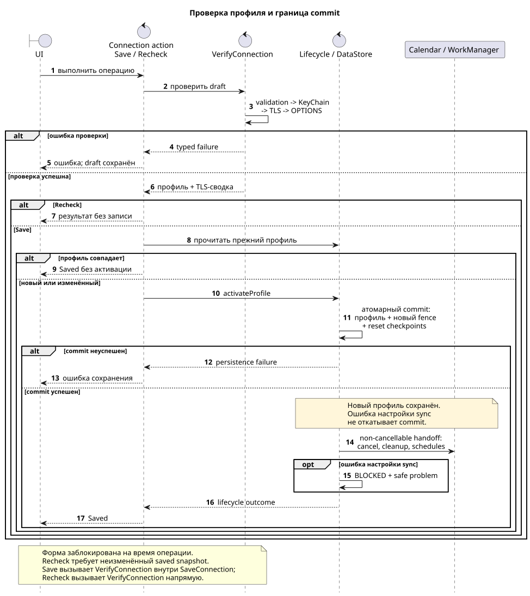

# Настройка и проверка подключения

[Все документы](README.md)

Проверка подтверждает доступность HTTPS/mTLS и возможности ActiveSync.
Она не читает mailbox. После успешного сохранения нового или изменённого
профиля приложение отдельно настраивает синхронизацию календаря.

Нормативные сценарии: [connection-settings](../openspec/specs/connection-settings/spec.md).
Технические проверки: [транспорт](transport.md).

## Содержание

- [Профиль и валидация](#профиль-и-валидация)
- [Состояние формы](#состояние-формы)
- [Клиентский сертификат](#клиентский-сертификат)
- [Сохранение и повторная проверка](#сохранение-и-повторная-проверка)
- [TLS-сводка](#tls-сводка)
- [Ошибки](#ошибки)

## Профиль и валидация

| Поле | Допустимое значение |
|---|---|
| Email | Ровно один `@`, непустые части до и после, без пробелов |
| Учётное имя | `domain\login`: ровно один обратный слеш, непустые части, без пробелов |
| Сервер | DNS hostname не длиннее 253 символов; без пробелов, схемы, пути, query, fragment и явного порта |
| Сертификат | Выбранный непустой alias из Android KeyChain |

Протокол всегда HTTPS, порт — 443, путь ActiveSync задаёт приложение.
Все четыре поля проверяются одновременно. Невалидный draft возвращает ошибки
всех затронутых полей без доступа к KeyChain, HTTP или записи DataStore.

## Состояние формы

| Состояние | Поведение |
|---|---|
| Начальная загрузка | Progress; поля, chooser и Save заблокированы |
| Профиль отсутствует | Пустая редактируемая форма |
| Профиль загружен | Подключённое состояние; сохранён private snapshot профиля |
| Есть несохранённые изменения | Повторная проверка недоступна до восстановления исходных значений или успешного Save |
| Выполняется Save или повторная проверка | Общее состояние операции блокирует поля, chooser и оба действия |
| Проверка завершилась ошибкой | Draft остаётся для исправления; прежняя TLS-сводка очищается |

Редактирование и выбор сертификата сами по себе не запускают сеть и не меняют
сохранённый профиль. Блокировки не позволяют позднему чтению DataStore
перезаписать draft или показать результат проверки для другого профиля.

## Клиентский сертификат

`MainActivity` вызывает системный `KeyChain.choosePrivateKeyAlias` для текущего
HTTPS hostname и порта 443. Ограничения по issuer и key type не задаются, чтобы
не исключать сертификаты частного развёртывания. Текущий alias передаётся как
предварительно выбранный; отмена chooser сохраняет прежнее значение.

Приложение хранит только alias; ключ и цепочка разрешаются на время проверки.
Если alias удалён, отозван или недоступен, операция прекращается до HTTP
и предлагает повторный выбор. [Разрешение identity и её границы](transport.md#клиентская-identity).

## Сохранение и повторная проверка

Все операции используют один `VerifyConnection`: локальная валидация →
разрешение KeyChain → создание TLS transport → HTTPS/mTLS и `OPTIONS`.

| Операция | После успешной проверки |
|---|---|
| Save нового или изменённого профиля | Атомарно сохраняет профиль, новую generation/run token и сброшенные checkpoints; затем очищает owned calendar и передаёт работу WorkManager |
| Save неизменённого профиля | Возвращает успешный результат без замены профиля и запуска новой синхронизации |
| Повторная проверка | Проверяет неизменённый snapshot через `VerifyConnection`, без `SaveConnection`, commit и lifecycle activation |

При активации профиля post-commit handoff выполняется в non-cancellable
участке: отменяет прежнюю работу, очищает собственный календарь и восстанавливает
periodic/immediate work.

| Где произошла ошибка | Что остаётся |
|---|---|
| Валидация, KeyChain, TLS, HTTP или capability probe | Предыдущий профиль, календарь и generation не меняются |
| Чтение предыдущего профиля или атомарное сохранение | Ошибка persistence; новая активация не считается завершённой |
| Разрешения, cleanup или scheduling после commit | Новый профиль уже сохранён; отдельная проблема синхронизации без отката профиля |

Управление такой проблемой описано в [фоновой синхронизации](background-sync.md).

## TLS-сводка

После успешного terminal response приложение показывает эфемерную TLS-сводку:
конечный hostname и доступную из проверенного handshake цепочку server X.509
сертификатов от leaf к issuer. Для каждого сертификата отображаются RFC 2253
subject и issuer, серийный номер в шестнадцатеричном виде, период действия и
SHA-256 fingerprint. Это метаданные текущего результата: PEM/DER, client key
material и сертификатные байты не выводятся и не сохраняются. Если успешный
HTTPS response не даёт пригодной X.509-цепочки, проверка возвращает отдельную
категорию diagnostic error вместо частичного успешного результата.

После редактирования формы или неуспешной проверки сводка очищается.
Она не сохраняется в DataStore и не восстанавливается после пересоздания
приложения.

## Ошибки

| Группа | Категории, доступные UI |
|---|---|
| Сертификат | Alias недоступен |
| Сеть | DNS, соединение, timeout |
| TLS | Server trust, hostname, missing/invalid local CA, mTLS |
| HTTP | Access denied, endpoint mismatch, redirect policy, server error |
| Протокол | Несовместимость ActiveSync |
| Диагностические данные | Недоступна пригодная server X.509 chain |
| Локальные операции | Persistence или неизвестная ошибка |

UI получает устойчивую категорию без exception messages, response bodies,
stack traces или key material. Технические причины доступны в
[Logcat](diagnostics.md). Ограничения проверки и trust setup собраны в
[документе о транспорте](transport.md#принятые-ограничения).
