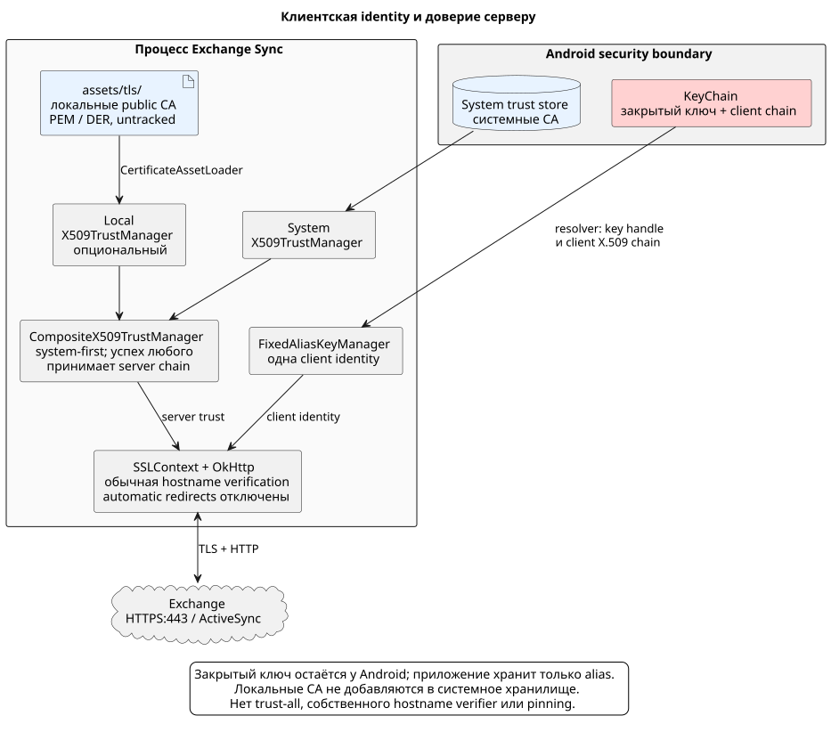

# HTTPS, mTLS и ActiveSync-сеанс

[Все документы](README.md)

Транспорт используется и для проверки профиля, и для календарных команд.
Он связывает выбранную клиентскую identity, доверие серверу и общий HTTP-сеанс.

Нормативные сценарии:
[connection-settings](../openspec/specs/connection-settings/spec.md) и
[calendar-sync](../openspec/specs/calendar-sync/spec.md).

## Содержание

- [Клиентская identity](#клиентская-identity)
- [Доверие TLS](#доверие-tls)
- [Проверка возможностей ActiveSync](#проверка-возможностей-activesync)
- [Перенаправления](#перенаправления)
- [HTTP-сеанс процесса](#http-сеанс-процесса)
- [Принятые ограничения](#принятые-ограничения)

## Клиентская identity



Приложение хранит только alias. Перед probe infrastructure вызывает
`KeyChain.getPrivateKey` и `KeyChain.getCertificateChain` на I/O dispatcher и
создаёт key manager, который предоставляет TLS только выбранные ключ и цепочку.
Закрытый ключ не сериализуется, не логируется и не передаётся в presentation
layer. Если alias удалён, отозван или недоступен, проверка прекращается до HTTP
и UI запрашивает повторный выбор.

Получение KeyChain material и создание TLS transport выполняются вне Main
dispatcher. Настроенная identity — единственная, которую предоставляет transport.

Выбранные KeyChain private key и certificate
chain настраиваются как единственная client identity TLS transport. После
успешного проверенного HTTPS response пустой `Handshake.localCertificates`
считается отсутствующей у Android/Conscrypt participation metadata, а не
отказом mTLS. Если provider всё же возвращает local chain, её leaf должна
совпадать с настроенной identity; наблюдаемое несовпадение остаётся ошибкой.
Недоступный KeyChain material, TLS/hostname/server-chain failure и HTTP
authentication rejection также сохраняют прежние устойчивые категории ошибок.
Diagnostics поэтому различают факт настройки fixed identity и доступность
platform evidence, но не заявляют недоказанное участие конкретных байтов.

Парольная HTTP-аутентификация отсутствует. `OPTIONS` не создаёт
`Authorization`; календарные команды используют mTLS и передают
`domain\login` как percent-encoded query-параметр `User`.

## Доверие TLS

| Источник доверия | Как используется |
|---|---|
| Системное хранилище Android | Первый независимый trust manager |
| Локальные CA в `infrastructure/src/main/assets/tls/` | Опциональный trust manager из X.509 PEM/DER |

Локальный каталог полностью игнорируется Git и может отсутствовать. Поэтому
чистая сборка продолжает доверять публичным CA, включая Let's Encrypt, а
частные anchors не устанавливаются в системное хранилище Android.

Проверка выполняется system-first: успех любого trust manager принимает цепочку.
Trust-all fallback, отключение chain validation, собственный hostname verifier
и certificate pinning не используются.

Если оба trust manager отклоняют цепочку, классификатор анализирует
структурированные причины. Только системный `PKIXReason.NO_TRUST_ANCHOR`
разрешает категории missing или invalid local CA. При таком результате состояние
локальных assets намеренно приоритетнее более детального отказа локального
validator: сначала разработчик должен исправить packaged CA material. Прочие
ошибки сертификата остаются server-trust, а hostname mismatch имеет отдельную
категорию.

## Проверка возможностей ActiveSync

Первый запрос:

```http
OPTIONS https://<hostname>:443/Microsoft-Server-ActiveSync
```

| Проверка конечного ответа | Условие успеха |
|---|---|
| HTTP status | `200` |
| `MS-ASProtocolVersions` | Хотя бы одна из `14.0`, `14.1`, `16.0`, `16.1` |
| `MS-ASProtocolCommands` | Обе команды: `FolderSync` и `Sync` |
| TLS-диагностика | Пригодная проверенная server X.509 chain для [сводки](connection.md#tls-сводка) |

Токены заголовков разделяются запятыми и очищаются от пробелов; команды
сопоставляются без учёта регистра. Сервер только с ActiveSync 12.1 несовместим.

Номер семейства сборок Exchange Server 2019 `15.2.x` и версия wire-протокола
ActiveSync — разные величины. Приложение не ищет product-version metadata и не
добавляет `15.2` в заголовок `MS-ASProtocolVersions`: endpoint семейства 15.2
совместим, когда объявляет хотя бы одну из `14.0`, `14.1`, `16.0` или `16.1`.
Значение `15.2`, предложенное только как protocol version, отклоняется.

Тело ответа `OPTIONS` не читается и не участвует в результате probe: для
capability check значимы только terminal status, обязательные заголовки и TLS
diagnostics.

## Перенаправления

Автоматические redirects OkHttp отключены. Общий `RedirectTracker` остаётся
единственным источником redirect policy для capability и command paths: он
обрабатывает коды 300, 301, 302, 303, 307 и 308, сохраняет исходный HTTP method
и, для `POST`, неизменное WBXML body. Разрешены относительные и cross-host HTTPS
destinations. Каждый destination проходит обычную проверку hostname и цепочки
сертификатов. Такой явный цикл нужен, чтобы OkHttp не переписал ActiveSync
method/body и чтобы каждый hop попал в общую проверку и diagnostics.

| Свойство redirect | Правило |
|---|---|
| Протокол | Только HTTPS, включая относительные и cross-host destinations |
| Method/body | Исходный method и WBXML body сохраняются |
| TLS | Hostname и цепочка проверяются для каждого destination |
| Предел | Не более пяти redirects; посещённый URI нельзя повторять |
| `Location` | Обязателен, корректен, без embedded credentials |

Нарушение любого ограничения приводит к redirect-policy failure.
Каждый hop включается в общие проверки и диагностику.

## HTTP-сеанс процесса

Один создаваемый `AppContainer` ActiveSync runtime обслуживает и проверку
подключения, и календарные команды. Для точной identity профиля — hostname,
email, `domain\login` и KeyChain alias — runtime держит отдельный потокобезопасный
сеанс. В нём находятся cookie jar и последний успешно установленный в текущем
процессе capability result: terminal HTTPS endpoint, выбранная версия и набор
поддерживаемых версий.

Cookie принимаются и заменяются по обычной identity name/domain/path,
просроченные и удалённые сервером значения отбрасываются. При последующих
`OPTIONS`, redirect, `FolderSync` и `Sync` отправляются только подходящие по
Secure, host/domain, path и expiry cookie. Поэтому cookie redirect destination
не уходит на посторонний host. Реестр ограничен четырьмя недавно использованными
профилями; вытеснение безопасно и приводит лишь к новому capability discovery.

Сеанс существует только до завершения процесса. Cookie, их имена, значения и
атрибуты не записываются в DataStore и не попадают в UI или diagnostics. После
холодного старта календарная синхронизация всегда выполняет свежий `OPTIONS` до
первой команды, даже если на диске есть checkpoints. Сохранённая protocol
version продолжает использоваться, если сервер по-прежнему её объявляет; иначе
выбирается максимальная общая версия и выполняется fenced full reset до
повторного использования protocol-dependent checkpoints.

Для того же профиля новые verifier/remote-calendar transports получают общий
сеанс, но каждый создаёт TLS-клиент с выбранной mTLS identity и объединённым
server trust. Календарные retries и continuation slices также используют его.
Подготовка папки и pacing описаны в
[синхронизации календаря](calendar-sync.md#сеанс-папка-и-интервал-запросов).

## Принятые ограничения

| Ограничение | Практический смысл |
|---|---|
| `OPTIONS` проверяет capabilities | Доступ к mailbox и основному календарю проверится при синхронизации |
| Trust managers, `SSLContext` и OkHttp создаются синхронно вне Main | Отдельного жёсткого deadline нет; блокировка security provider может превысить номинальный probe timeout |
| Нет парольной HTTP-аутентификации | Используется выбранная mTLS identity |
| Нет certificate pinning и бесшовной смены server certificates | Действуют описанные источники доверия |

Граница автоматических и выполненных ручных проверок:
[проверка реализации](architecture.md#проверка-реализации).
